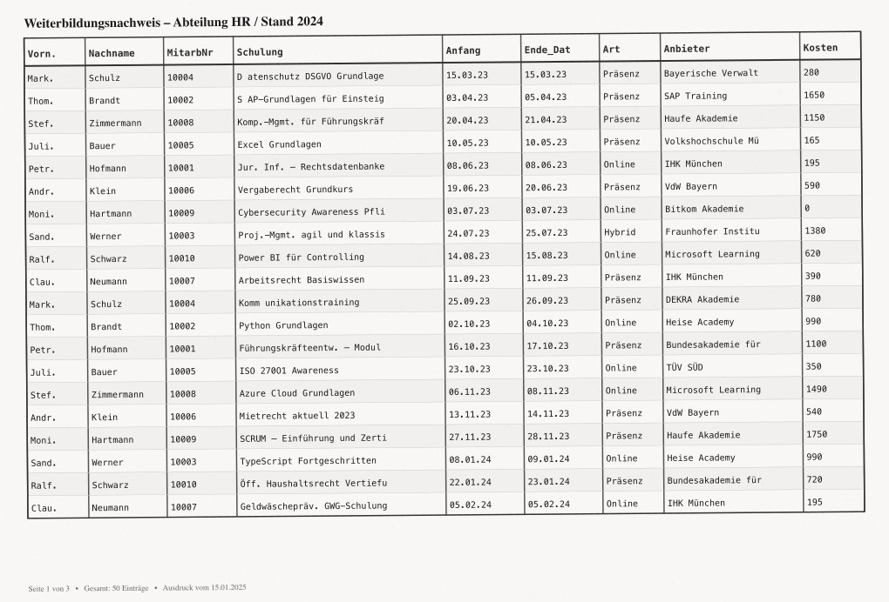
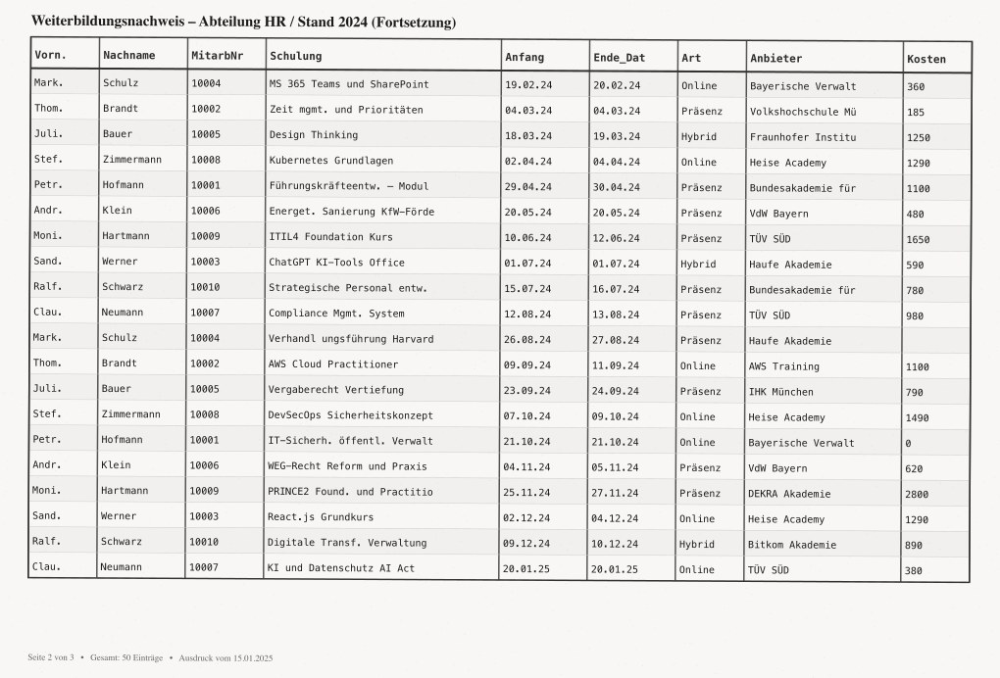
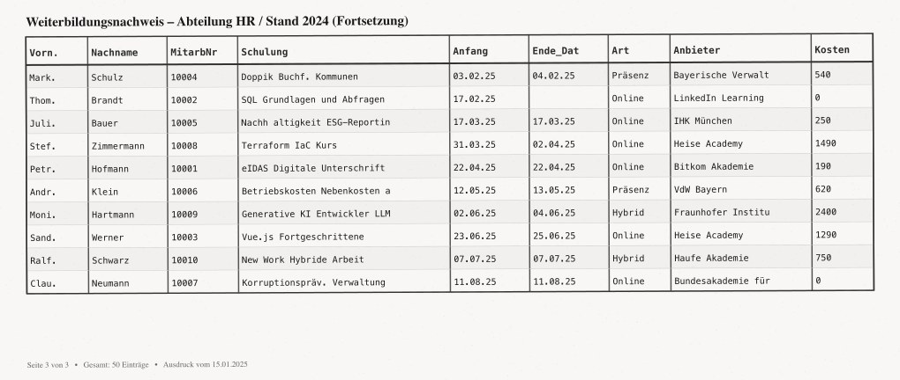

# Erfahrungsbericht: Datenimport-Simulation für AKDB

**Projekt:** Interaktive Nutzerstudie zur Evaluation von Import-Methoden
**Technologie:** Vue 3 · Vite · Tailwind CSS · Pinia · shadcn-vue
**Zeitraum:** März 2026
**Kontext:** Interne UX-Studie für die AKDB (Anstalt für Kommunale Datenverarbeitung in Bayern)

---

## Hintergrund

Bevor eine neue Funktion zum Import von Weiterbildungshistorien in ein bestehendes Personalverwaltungssystem implementiert wird, sollte zunächst evaluiert werden, **welche Import-Methode die beste Nutzererfahrung** bietet. Statt drei vollständige Backends zu entwickeln, wurde eine interaktive Simulation gebaut — realistisch genug, um echtes Nutzerverhalten zu messen, aber ohne Backend-Anbindung oder echte Datenpersistenz.

---

## Die drei getesteten Import-Methoden

### Methode 1 — Excel-Vorlage

Nutzer laden eine vorgefertigte Excel-Vorlage herunter, füllen sie offline aus und laden sie wieder hoch. Das System erkennt alle Spalten automatisch, da sie 1:1 dem Datenmodell entsprechen.

**Simulierte Daten:** 15 saubere Einträge mit wenigen Warnings.

### Methode 2 — Eigene Excel-Datei

Nutzer laden ihre bereits vorhandene Excel-Datei hoch. Das System analysiert die Spaltenstruktur und schlägt Zuordnungen vor. Nicht erkannte Spalten müssen manuell zugeordnet werden.

**Simulierte Daten:** 100 Einträge mit informellen/englischen Spaltennamen (z. B. „Seminar" statt „Bezeichnung").

### Methode 3 — Foto- oder PDF-Scan mit KI

Nutzer fotografieren einen Tabellenausdruck oder laden einen PDF-Scan hoch. Eine animierte KI-Analyse erkennt die Struktur und schlägt Spaltenzuordnungen vor — markiert mit einem KI-Badge.

**Simulierte Daten:** 50 Einträge mit OCR-typischen Artefakten (abgekürzte Spaltennamen, Datumsformate wie „15.03.23" statt ISO-Format, Leerzeichen-Fehler in Bezeichnungen).

---

## Technische Umsetzung

### Stack

| Bereich | Technologie | Entscheidung |
|---|---|---|
| Framework | Vue 3 (Composition API) | Teamstandard |
| Build | Vite | Schnelles HMR, einfache Konfiguration |
| UI | shadcn-vue + Tailwind CSS v3 | Konsistente, zugängliche Komponenten |
| State | Pinia + pinia-plugin-persistedstate | localStorage-Persistenz für Wizard-Schritte |
| Routing | Vue Router 4 | Pro Methode eine Route (`/methode/1-3`) |
| Icons | lucide-vue-next | Einheitliches Icon-Set |

### Architektur-Highlights

**Wizard-Pattern:** Jede der drei Methoden ist als eigenständiger Wizard mit 6–7 Schritten implementiert. Der aktuelle Schritt wird im Pinia-Store persistiert — Seiten-Refresh verliert keinen Fortschritt.

**State-Isolation:** Jede Methode hat einen vollständig unabhängigen State. Ein Klick auf „Starten" auf der Startseite setzt den jeweiligen Methoden-State zurück, sodass alle drei Methoden beliebig oft und in beliebiger Reihenfolge durchlaufen werden können.

**Mock-Daten-Simulation:** Das System verarbeitet keine echten Dateien. Stattdessen werden bei Upload der richtigen Dateitypen die passenden Mock-JSON-Daten geladen — für Nutzer unsichtbar und realistisch.

**Spalten-Mapping mit Konfidenz-Feedback:** Die Mapping-Maske zeigt für jede erkannte Spalte einen Konfidenz-Badge (Sicher / Unsicher / Nicht erkannt). Sobald ein Nutzer eine unbekannte Spalte manuell zuordnet, wechselt der Badge von „Nicht erkannt" (rot) zu „Manuell zugeordnet" (grün).

**Scan-Simulation:** Für Methode 3 wurden drei realistische Scan-Bilder programmatisch generiert:
- Leicht schräge Ausrichtung (unterschiedliche Rotationswinkel je Seite)
- Scan-Artefakt-Rauschen im Hintergrund
- Monospace-Schrift und OCR-typische Abkürzungen
- Seitennummerierung („Seite 1 von 3")

*Seite 1 des simulierten Scan-Dokuments*

*Seite 2 — leicht andere Rotation*

*Seite 3 mit verbleibenden 10 Einträgen*

---

## Besondere Herausforderungen

### nvm und PATH
Node.js wird über nvm verwaltet und ist damit nicht im System-PATH des Preview-Servers verfügbar. Lösung: In `.claude/launch.json` den absoluten Node-Pfad hinterlegen und alle Shell-Befehle mit explizitem PATH-Prefix ausführen.

### shadcn-vue ohne CLI
Das interaktive `npx shadcn-vue@latest init` konnte im Agenten-Kontext nicht verwendet werden. Alle UI-Komponenten (Button, Card, Badge, Dialog, Alert, Select, Checkbox, Progress, Separator, Textarea) wurden manuell in `src/components/ui/` implementiert.

### Vite-Setup in bestehendem Verzeichnis
`npm create vite@latest .` bricht in nicht-leeren Verzeichnissen ab. Alle Vite-Boilerplate-Dateien (package.json, index.html, vite.config.js, tailwind.config.js, postcss.config.js) wurden manuell erstellt.

### 3-seitiges PDF programmatisch
Das Scan-PDF wurde als valide PDF-1.4-Datei mit korrekter Struktur (9 Objekte: Catalog, Pages, 3×Page, 3×Content-Stream, Font) und byte-genauer xref-Tabelle manuell generiert — ohne externe PDF-Bibliothek.

---

## Feedback-System

Nach jeder Methode bewertet der Testnutzer drei Dimensionen mit 1–5 Sternen:

- **Einfachheit** — Wie intuitiv war die Bedienung?
- **Praxisnähe** — Passt die Methode zum Arbeitsalltag?
- **Neuartigkeit** — Wie zukunftsweisend wirkt der Ansatz?

Dazu ein optionaler Freitext. Nach dem Durchlauf aller drei Methoden folgt ein vergleichendes Fazit mit Präferenzauswahl und Begründung.

Die Auswertungsseite (`/ergebnis`) vergleicht die Feedback-Werte aller drei Methoden und ermöglicht den Export als Markdown-Datei.

---

## Ergebnis

Die Simulation ermöglicht es, echte Nutzerdaten über alle drei Import-Ansätze zu sammeln, **bevor** auch nur eine Zeile Backend-Code geschrieben wurde. Das senkt das Risiko erheblich, eine Methode zu implementieren, die in der Praxis nicht angenommen wird.

Der vollständige Quellcode ist auf GitHub verfügbar: [eltuctuc/datenimport-simulation](https://github.com/eltuctuc/datenimport-simulation)
